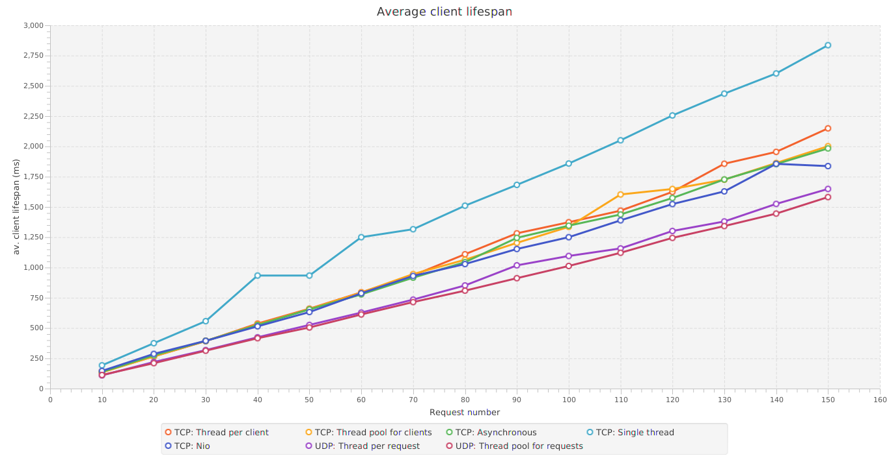

# Results

## Variable array length (message length)

### Benchmark parameters:

* Client Number = `4`
* Receive-Send Delay = `0`
* Per-client Request Number = `10`
* Array length, variable from `100` to `5000` with step = `100`
* Number of repeats = `5`

### Charts

## Variable client number

### Benchmark parameters:

* Receive-Send Delay = `5`
* Per-client Request Number = `100`
* Array length = `500`
* Client Number, variable from = `1` to `30` with step = `2`
* Number of repeats = `1`

### Charts

## Variable request number

### Benchmark parameters:

* Receive-Send Delay = `5`
* Client Number = `4`
* Array length = `500`
* Per-client Request Number, variable from `10` to `150` with step = `10`
* Number of repeats = `5`

### Charts

## Variable receive-send delay

### Benchmark parameters:

* Client Number = `4`
* Array length = `1000`
* Per-client Request Number = `100`
* Receive-Send Delay, variable from = `0ms`ms to `100ms` with step = `10`
* Number of repeats = `1`

### Charts

